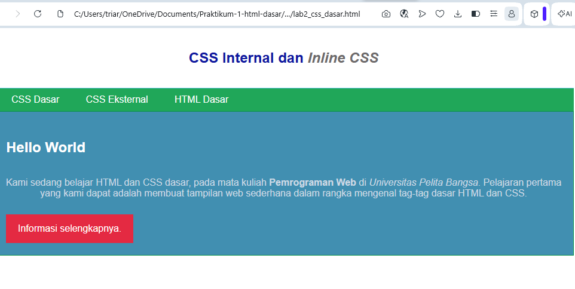

# PRAKTIKUM 3 - CSS DASAR

## Tujuan
1. Memahami konsep dasar CSS dalam pembuatan halaman web.
2. Mengetahui aturan dan cara penulisan CSS yang tepat.
3. Memahami penggunaan selector untuk mengatur elemen-elemen HTML.
4. Mampu menerapkan CSS pada HTML untuk mengatur tampilan halaman web.

## Langkah-Langkah Praktikum
1. Membuat File HTML
Langkah pertama adalah membuat file HTML dengan nama lab2_css_dasar.html. Kemudian dibuat struktur dasar HTML yang terdiri dari bagian head dan body. Pada bagian body ditambahkan header, navigasi, judul, paragraf, dan link.

2. Menerapkan CSS Internal
Setelah struktur HTML selesai, CSS Internal ditambahkan pada bagian head menggunakan tag style. CSS digunakan untuk mengatur jenis huruf, ukuran teks, warna, posisi teks, dan tampilan header. 

3. Menerapkan Inline CSS
Selanjutnya diterapkan Inline CSS pada elemen paragraf. Pengaturan CSS ditulis langsung pada tag HTML menggunakan atribut style untuk mengubah tampilan teks.

4. Membuat CSS Eksternal
Kemudian dibuat file style_eksternal.css untuk menyimpan kode CSS secara terpisah dari file HTML. File CSS tersebut dihubungkan ke dokumen HTML menggunakan tag link.

5. Mengatur Tampilan Navigasi
Pada CSS eksternal ditambahkan pengaturan untuk menu navigasi dan link. Pengaturan meliputi warna latar belakang, warna teks, jarak antar-link, serta perubahan tampilan ketika kursor diarahkan ke link.

6. Menggunakan ID Selector
Selanjutnya digunakan ID Selector untuk memberikan pengaturan khusus pada bagian tertentu dari halaman. ID Selector menggunakan tanda # dan diterapkan pada elemen dengan ID intro.

7. Menggunakan Class Selector
Class Selector digunakan untuk memberikan tampilan tertentu pada elemen yang memiliki class yang sama. Selector ini ditulis menggunakan tanda titik (.), kemudian diterapkan pada elemen HTML yang sesuai.

8. Melihat Hasil Praktikum
Setelah seluruh kode selesai dibuat, file disimpan dan dibuka melalui browser. Kemudian halaman di-refresh untuk memastikan seluruh CSS telah diterapkan dengan baik.

## Screenshot hasil praktikum:

## Kesimpulan
Pada praktikum ini saya mempelajari cara menerapkan CSS pada HTML untuk mengatur tampilan halaman web. Saya juga memahami penggunaan CSS Internal, Inline CSS, CSS Eksternal, ID Selector, dan Class Selector.

# Jawaban Pertanyaan dan Tugas

## Praktikum 3 – CSS Dasar

### 1. Eksperimen Mengubah dan Menambah Properti CSS

Eksperimen dilakukan dengan mengubah dan menambahkan beberapa properti serta nilai pada CSS. Tujuannya untuk melihat perubahan tampilan pada halaman web. Perubahan tersebut dapat berupa warna tulisan, warna latar belakang, ukuran tulisan, jenis huruf, posisi teks, dan tampilan elemen lainnya.

Dari eksperimen tersebut dapat diketahui bahwa setiap properti CSS memiliki fungsi yang berbeda dalam mengatur tampilan halaman web.

### 2. Perbedaan Pendeklarasian CSS `h1` dengan `#intro h1`

Perbedaannya terletak pada elemen yang menjadi sasaran pengaturan CSS.
h1 digunakan untuk mengatur semua elemen heading h1 yang terdapat pada halaman.
Sedangkan #intro h1 digunakan untuk mengatur elemen h1 yang berada di dalam elemen yang memiliki ID intro.

Jadi, h1 memiliki cakupan yang lebih umum, sedangkan intro h1 lebih khusus karena hanya diterapkan pada h1 yang berada di dalam bagian dengan ID `intro`.

### 3. CSS Internal, Eksternal, dan Inline

Jika CSS Internal, CSS Eksternal, dan Inline CSS diterapkan pada elemen yang sama, maka **Inline CSS yang akan ditampilkan** karena aturan tersebut dituliskan langsung pada elemen HTML.

Sebagai contoh, apabila warna teks suatu paragraf diatur berbeda melalui CSS Internal, CSS Eksternal, dan Inline CSS, maka warna yang diberikan melalui Inline CSS akan menjadi tampilan yang digunakan pada browser.

Jadi, dari ketiga cara tersebut, **Inline CSS memiliki prioritas lebih tinggi** dalam kondisi normal. Modul menjelaskan bahwa CSS Internal ditulis di dalam dokumen HTML, CSS Eksternal ditulis pada file CSS terpisah, sedangkan Inline CSS ditulis langsung sebagai atribut pada tag HTML.

### 4. Prioritas ID dan Class Selector

Jika suatu elemen HTML memiliki ID dan Class sekaligus, kemudian kedua selector tersebut mempunyai pengaturan CSS yang berbeda, maka **ID Selector memiliki prioritas lebih tinggi daripada Class Selector**.

Sebagai contoh, pada sebuah paragraf yang memiliki ID `paragraf-1` dan Class `text-paragraf`, apabila ID memberikan warna merah sedangkan Class memberikan warna biru, maka warna yang akan ditampilkan adalah **merah** karena ID mempunyai prioritas yang lebih tinggi.

Jadi, urutan prioritas dalam kasus tersebut adalah:

**ID Selector > Class Selector > Element Selector**

ID Selector menggunakan tanda pagar (`#`), sedangkan Class Selector menggunakan tanda titik (`.`).
